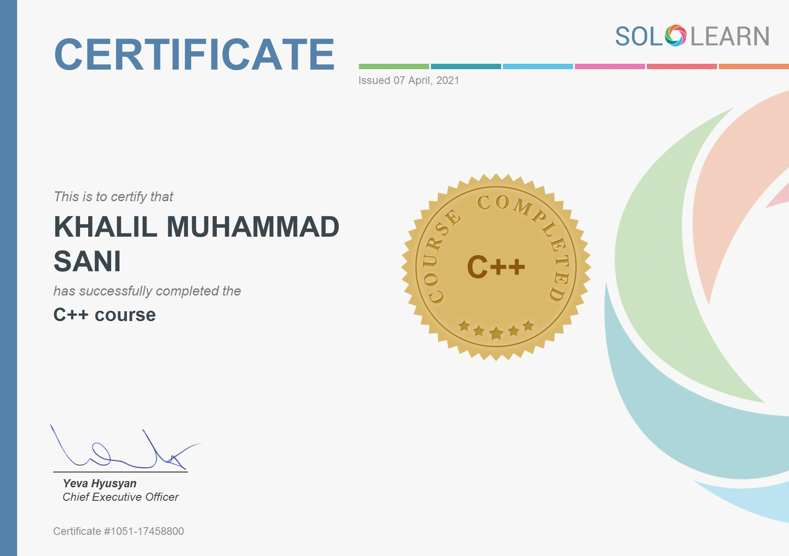
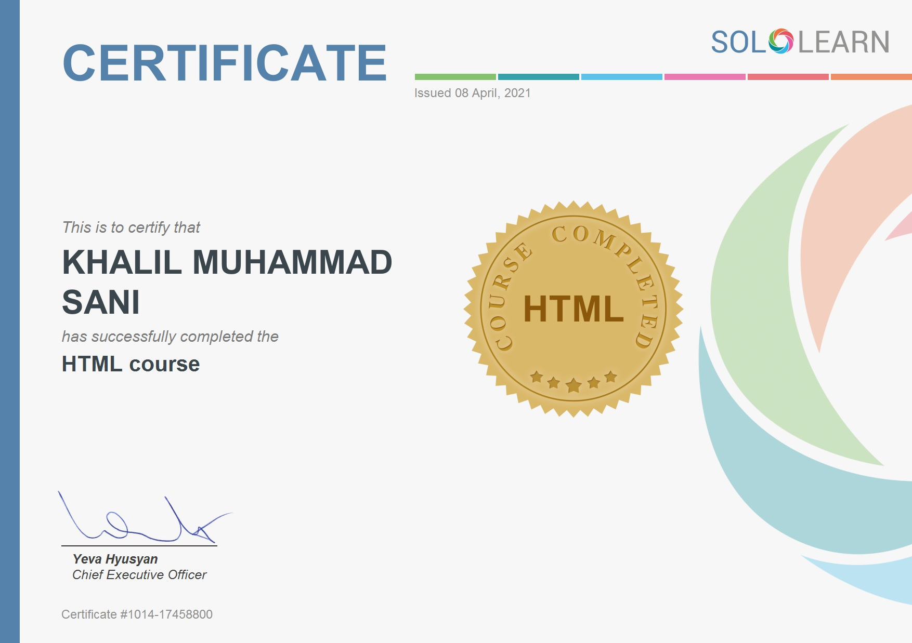
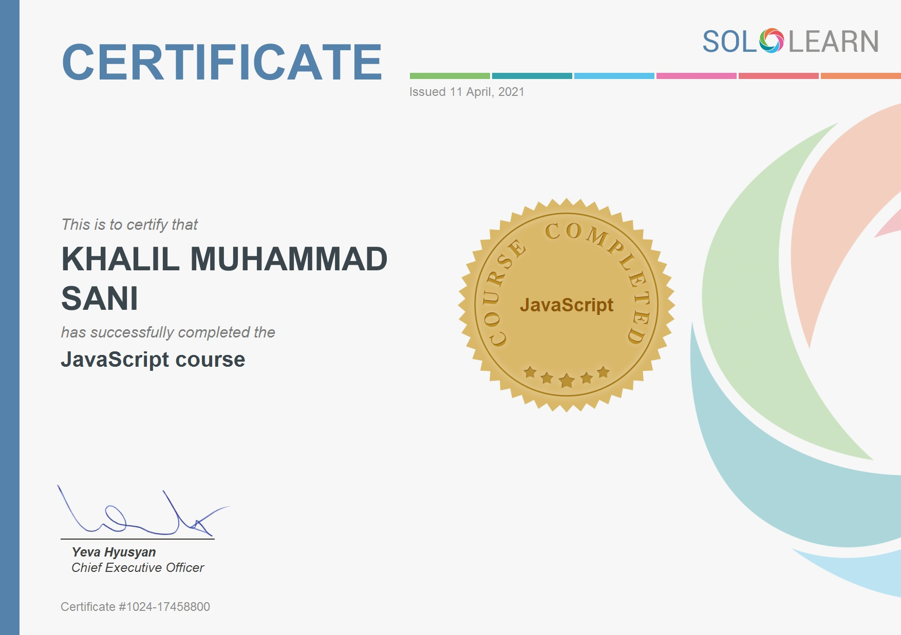

---

**Data Analyst | Software Developer | Innovator**

  

    
    

---

## 🌟 Professional Summary

Driven Computer Science student specializing in Database Systems at Illinois Institute of Technology with a passion for data analytics and software development. I thrive on transforming complex data into actionable insights and am committed to using technology to solve real-world problems and create impactful solutions.

---

### 🛠️ Skills and Expertise

**Data Analysis Tools**

 
 

**Development Tools**

 
 

---

## 💼 Work Experience

### Data Analyst Intern
**Zenblen**  
*Chicago, Illinois, United States · On-site*  
*May 2024 - Present*

- Utilized Python and SQL to perform exploratory and statistical data analysis, driving data-driven decision-making.
- Developed a dynamic Grafana dashboard for robotic kiosk inventory management, enhancing data visualization, real-time monitoring, and analytics. Improved inventory efficiency by 20% and reduced costs by 15% through actionable insights.
- Created interactive dashboards and reports in Microsoft Power BI and Tableau to communicate insights to stakeholders.
- Collaborated with cross-functional teams to design data models and optimize data pipelines in Microsoft Azure.

### IT Support Specialist
**FinTech**  
*Zaria, Kaduna State, Nigeria · On-site*  
*March 2021 - April 2023*

- Led staff training on Excel, SQL, and Tableau, enhancing team capability in data-driven decision-making.
- Provided technical support and troubleshooting for software and hardware issues using C++, Python, and Java, ensuring minimal downtime.
- Managed cloud-based services on AWS and GCP, optimizing data storage.
- Developed and maintained databases using SQL and created reports using Microsoft Power BI and Tableau to support business operations.
- Utilized Microsoft Excel to develop dashboards and reports for business performance monitoring, achieving a 10% increase in operational efficiency.

### Founder
**Ibk Graphics**  
*Abuja, Nigeria · Self-Employed*  
*September 2019 - October 2021*

- Founded and led a successful graphic design company, driving the company’s vision and mission.
- Provided creative direction for all design projects, ensuring high-quality deliverables aligned with client objectives.
- Cultivated strong client relationships, resulting in a high level of satisfaction and repeat business.
- Built and led a cohesive team of designers, fostering a collaborative and innovative work environment.

---

## 🚀 Featured Projects

- **[Enhancing City Mobility with Cab Data Analytics](https://github.com/Ksani1/Enhancing-City-Mobility-with-Cab-Data-Analytics)**: Analyzed cab data to compare pricing models and predictive techniques of two companies, leveraging advanced analytics to improve urban mobility solutions.
  - **Technologies Used**: Python, R, Pandas, SQL
  - **Impact**: Enhanced city mobility insights and strategic planning.

- **[Payment Gateway](https://github.com/Ksani1/payment-gateway)**: Developed a robust payment gateway model using Java, focusing on secure transaction processing and user-friendly interfaces.
  - **Technologies Used**: Java, Spring Boot
  - **Impact**: Improved transaction security and efficiency.

- **[Customer Service Chatbot](https://github.com/Ksani1/customer-service-chatbot)**: Created a chatbot for a robotic kiosk using Java, NLP, and TensorFlow to enhance customer interactions and streamline data retrieval.
  - **Technologies Used**: Java, TensorFlow, NLP
  - **Impact**: Improved customer service and data management efficiency.

---

## 📈 Analytics and Visualization

I excel in transforming data into visually compelling and actionable insights. Whether using Python for data wrangling, R for statistical analysis, or Tableau for interactive dashboards, I bring data to life to drive informed decision-making.

---

## 🎓 Educational Background

- **Illinois Institute of Technology** - Specializing in Database Systems
- **IAEC University, Togo** - Bachelor of Science in Computer Science
- **Informatics Academy, Singapore** - Diploma in Information Technology
  
---

## 🎓 Certifications

Below are the certifications I have obtained, along with optimized images for better loading performance:

- **SQL Certification** - Sololearn (April 2021)
  -  <!-- Optimized: Compressed and resized for faster loading -->
  
- **C++ Certification** - Sololearn (April 2021)
  -  <!-- Optimized: Converted to WebP format for smaller file size -->
  
- **HTML5 Application Development** - Sololearn (April 2021)
  -  <!-- Optimized: Resized to fit better within the portfolio layout -->

- **JavaScript Certification** - Sololearn (April 2021)
  -  <!-- Optimized: Compressed to maintain quality while reducing size -->

## Image Optimization

To ensure that the images in my portfolio load quickly and efficiently, I have taken the following steps:

1. **Compression**: Reduced the file size of each image using image compression tools to minimize loading times while preserving quality.

2. **Resizing**: Adjusted the dimensions of the images to ensure they fit well within the layout of the portfolio and don't take up unnecessary space.

3. **Format Conversion**: Converted images to the WebP format where applicable, as it provides a balance of quality and file size.

## Contact

Feel free to reach out if you have any questions or if you'd like to learn more about my work:

- Email: [your-email@example.com](mailto:your-email@example.com)
- LinkedIn: [Your LinkedIn Profile](https://www.linkedin.com/in/your-profile)
- GitHub: [Your GitHub Profile](https://github.com/your-github-profile)

Thank you for visiting my portfolio!
Instructions for Using the README
Image Links: Replace the image file names (e.g., SQL.webp) with the correct file paths where your images are stored. Make sure the image format and name match the ones you've used.

Contact Information: Replace the placeholders for email, LinkedIn, and GitHub with your actual contact details.

Optimization Details: Adjust the descriptions of your optimization methods if you've used different tools or techniques.

This README.md provides a professional overview of your portfolio, highlights your certifications, and explains the optimizations made for a better user experience.

    
    

ChatGPT
To include this HTML snippet in your portfolio's README.md or other documentation, you can describe the structure and purpose of the code snippet rather than embedding it directly, as Markdown does not support HTML styling. Here's an explanation and description you can use:

Profile Card
Below is the HTML code used to create a visually appealing profile card for my portfolio. This card displays a profile picture and relevant information about myself in a neatly styled format.

html
Copy code

    
    

        <!-- Add your name, title, and other information here -->
        <h2>Khalil Muhammad</h2>
        
Software Developer

        
Specializing in Web Development and Programming

    

Features
Profile Image: The img tag includes a src attribute pointing to Photo.png, which should be replaced with the actual path of your image file.
Styling: The profile picture is styled to be circular with a border using border-radius and border.
Container: The outer div uses flex display to align the image and text side by side, with a light gray background, padding, rounded corners, and a subtle shadow for an elegant look.
Text Section: This section is a placeholder for additional information, such as your name, job title, and a brief description.
Usage
Image: Make sure to replace "Photo.png" with the path to your actual profile image.
Text Content: Modify the inner div content to reflect your actual name, title, and personal details.
Styling: Feel free to customize the styles (e.g., colors, shadows) to better match your personal brand or portfolio design.
This HTML snippet can be included in your portfolio website to provide a professional and stylish introduction to visitors.

arrange certifications image to be the size of profile image
ChatGPT
To ensure that your certification images are consistent in size with your profile image (150px wide), you can resize them using HTML or CSS. Here’s how you can modify your HTML to resize the images:

HTML Code
Below is an example of how you can arrange your certifications with images resized to 150px in width to match the profile image size:

html
Copy code

    
    

        <h2>Khalil Muhammad</h2>
        
Software Developer

        
Specializing in Web Development and Programming

    

## 🎓 Certifications

    

        
        
SQL Certification - Sololearn (April 2021)

    

    

        
        
C++ Certification - Sololearn (April 2021)

    

    

        
        
HTML5 Application Development - Sololearn (April 2021)

    

    

        
        
JavaScript Certification - Sololearn (April 2021)

    

    
---

## 🌐 Connect with Me

  

---

  
<h3>👨‍💻 Khalil's Coding Journey</h3>

  My coding journey began with a strong interest in technology and software development. I attended Informatics Academy in Singapore and IAEC University in Togo to build a solid foundation in computer science. Now, MS in Computer Science at the Illinois Institute of Technology, I am specializing in Database Systems and continually advancing my skills in software engineering and data analysis.

---

